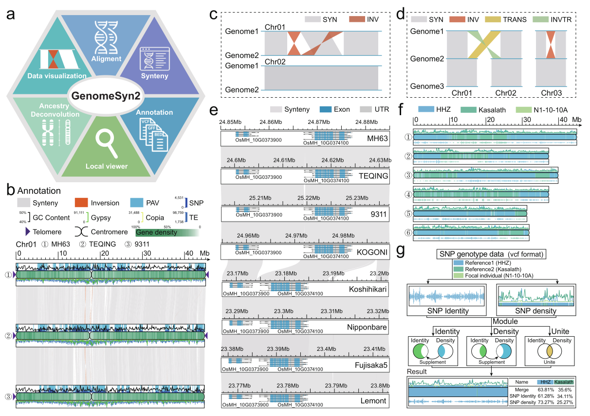

# [GenomeSyn-II: A Comparative Genomics Framework Integrating Synteny Visualization](https://cbi.gxu.edu.cn/zwzhou/GenomeSyn/GenomeSyn2-v1.0.0.tar.gz)


[](https://github.com/banzhou59/GenomeSyn2/releases)
[](LICENSE)
[](https://bioconda.github.io/recipes/genomesyn2/README.html)
[](https://anaconda.org/bioconda/genomesyn2)

<table style="width:100%; max-width:100%; border-collapse: collapse;">
    <tr>
      <th>Author</th>
      <th>E-mail</th>
    </tr>
    <tr>
      <td><a href="https://github.com/banzhou59">Zu-Wen Zhou</a></td>
      <td><code>784012725@qq.com</code></td>
    </tr>
    <tr>
      <td><a href="https://lst.gxu.edu.cn/info/1077/2334.htm">Ling-Ling Chen</a></td>
      <td><code>jmsong@swu.edu.cn</code></td>
    </tr>
    <tr>
      <td><a href="http://agronomy.swu.edu.cn/info/1081/5164.htm">Jia-Ming Song</a></td>
      <td><code>llchen@gxu.edu.cn</code></td>
    </tr>
</table>


The tool integrates multi-genome synteny relationships with diverse statistical and annotation features, enabling systematic exploration of genome rearrangement patterns, tracing of genomic region origins, and quantitative comparison of parental contributions, thus providing an efficient and intuitive visualization platform for comparative genomics and population genetics research.

<div align="center"></div>

## Dependencies

***GenomeSyn2 Environment Requirements***

GenomeSyn2 requires a Linux environment with both Perl and Python installed, along with several bioinformatics tools and libraries.
All dependencies can be easily installed using a Conda environment defined in the provided environment.yml file.

***1. Perl and perl modules***

**[Perl](https://www.perl.org)** ≥ 5.32 — the main language used for running GenomeSyn2 scripts

**[perl-bioperl-core](https://anaconda.org/bioconda/perl-bioperl-core)** — provides BioPerl functionalities for sequence and annotation processing

**[perl-svg](https://anaconda.org/bioconda/perl-svg)** — supports generation of scalable vector graphics (SVG) output

***2. Python and python modules***

**[Python](https://www.python.org)** ≥ 3.8 — required for auxiliary data visualization and conversion tools

**[cairosvg](https://cairosvg.org/)** — used for converting SVG files to PNG or PDF formats

***3. Other bioinformatics tools***

**[MUMmer](https://anaconda.org/bioconda/mummer)** — for whole-genome alignment and synteny detection

[minimap2](https://anaconda.org/bioconda/minimap2) — for fast and accurate sequence alignment

**[gffread](https://anaconda.org/bioconda/gffread)** — for extracting transcript and protein sequences from GFF/GTF files

**[Seqkit](https://anaconda.org/bioconda/seqkit)** — for efficient FASTA/FASTQ file manipulation

**[blast](https://anaconda.org/bioconda/blast)** — for sequence similarity searches

**[DIAMOND](https://anaconda.org/bioconda/diamond)** — for fast protein alignment

**[mmseqs2](https://anaconda.org/bioconda/mmseqs2)** — for large-scale sequence clustering and homology search


After installing the dependencies with Conda and activating the Conda environment, install GenomeSyn2 using **one** of the following options:

```
conda env create -f environment.yml

conda activate GenomeSyn2
```

## Installation

### Installation options

1. Use git to clone the project repository:
GenomeSyn2 does not require compilation and can be run directly.
To enable running GenomeSyn2.pl from any directory, it is recommended to add it to the environment variable $PATH.

```
git clone https://github.com/banzhou59/GenomeSyn2.git

cd ./GenomeSyn2/bin/

chmod +x *.pl *.sh

# To make this change permanent, add the line to your ~/.bashrc file and then run source ~/.bashrc to apply it immediately.

export PATH=/your_path/GenomeSyn2/bin:$PATH
```

2. Download the GenomeSyn2.tar.gz

```
wget https://cbi.gxu.edu.cn/zwzhou/GenomeSyn/GenomeSyn2-1.0.0.tar.gz

tar -zxvf GenomeSyn2.tar.gz

# To make this change permanent, add the line to your ~/.bashrc file and then run source ~/.bashrc to apply it immediately.

export PATH=/your_path/GenomeSyn2/bin:$PATH
```

### Test Installation

If installed successfully, you can check the version with:

```
GenomeSyn2 --help

# Download the test data of GenomeSyn2

wget https://cbi.gxu.edu.cn/zwzhou/GenomeSyn/GenomeSyn2_example_data.zip
```

# Quick start
1) The following commands demonstrate how to run GenomeSyn2 using different genome alignment software.

```
   GenomeSyn2 --align mummer --genome ./genome_path/ --outdir ./mummer/ --thread 30 > GS2.mummer.log

   GenomeSyn2 --align minimap2 --genome ./genome_path/ --outdir ./minimap2/ --thread 30 > GS2.minimap2.log
```

2) The following commands demonstrate how to run GenomeSyn2 for protein alignment using different alignment tools.

```
   GenomeSyn2 --align blastp --genome ./genome_path/ --gff ./gene_data/ --outdir ./blastp/ --thread 30 > GS2.blastp.log

   GenomeSyn2 --align mmseqs --genome ./genome_path/ --gff ./gene_data/ --outdir ./mmseqs/ --thread 30 > GS2.mmseqs.log

   GenomeSyn2 --align diamond --genome ./genome_path/ --gff ./gene_data/ --outdir ./diamond/ --thread 30 > GS2.diamond.log
```

3) Calculate SNP density and SNP identity from a VCF file to visualize multi-parental origin contributions:

```
   GenomeSyn2 --type identity --vcf ./parents.progeny.snps.genotype.Chr01.vcf --bin 50000 > GS2.vcf.log
```

4) Based on SNP density and SNP identity statistics, plot the multi-parental origins contribution:

```
   GenomeSyn2 --type identity --identity ./SNP_identity.50Kb.bed --density ./SNP_density.50Kb.bed > GS2.vcf.log
```


You can run GenomeSyn2 with a custom configuration file:
```
GenomeSyn2 --conf total.conf
```

# Configuration File Structure
Below is an example total.conf file with explanations for each section:
```
# less total.conf

[genome_info]
# gonomes_filetype = (fasta/bed)
# Type of genome description (fasta or bed)
gonomes_filetype = bed
# List of genome chromosome sizes or fasta files
gonomes_list = chr_length.info.tsv

[synteny_info]
# line_type = (curve/line)
# Style for connecting syntenic blocks. (curve or line)
line_type = curve
# File containing synteny information between genomes.
synteny_list = synteny.info.tsv

[save_info]
# figure_type = (svg/pdf/png)
# File format for saving figures. (svg, pdf, png)
figure_type = pdf
# savefig1 / savefig2: Output filenames for figure 1 and figure 2.
savefig1 = GenomeSyn2.figure1.pdf
savefig2 = GenomeSyn2.figure2.pdf

[centromere_info]
centromere_list = centromere.info.tsv

[telomere_info]
telomere_list = telomere.info.tsv
telomere_color = #441680
opacity = 100%

[show_region:no]
# region = (genome_Name:ChrID:start-end)
region = MH63:Chr10:24,850,000-24,885,000
gene_list = gene.info.tsv

[anno_info]
anno_number = [1,2,3,4,5,6,7]
anno_name = [PAV,SNP,TE,GC Content,Gypsy,Copia,Gene density]
anno_color = ['#5FB6DE','#0000FF','#3774B9','#000000','#00FF00','#F5F57A','#368F5C']
anno_type = [rectangle,barplot,barplot,lineplot,lineplot,lineplot,heatmap]
anno_position = [top,top,bottom,top,bottom,bottom,middle]
anno_height = [5,5,5,5,5,5,5]
min_max_value = [normal,auto,normal,0.4:0.5,normal,normal,normal]
anno_window = [none,none,100000,none,100000,100000,100000]
opacity = [50%,100%,100%,100%,100%,100%,100%]
file_type = [bed,bed,gff3,bed,gff3,gff3,gff3]
filter_type = [none,none,none,none,none,none,gene]
anno_list = [PAV.info.tsv,SNP.info.tsv,TE.info.tsv,GC.info.tsv,Gypsy.info.tsv,Copia.info.tsv,gene.info.tsv]
```

```
# less chr_length.info.tsv
#number	file_path	genome_name	tags
1	./fa_bed/1.MH63.genome.bed	MH63	height:5;opacity:0.8;color:'#39A5D6';
2	./fa_bed/2.T.genome.bed	T	height:5;opacity:0.8;color:'#43A98C';
3	./fa_bed/3.Y.genome.bed	Y	height:5;opacity:0.8;color:'#B8D891';
4	./fa_bed/4.M.genome.bed	M	height:5;opacity:0.8;color:'#528ABA';
...
```

```
# less synteny.info.tsv
#number	Ref	Query	align_file
1	1	2	./mummer/1.MH63_vs_T.delta.filter.tsv
2	2	3	./mummer/2.T_vs_Y.delta.filter.tsv
3	3	4	./mummer/3.Y_vs_M.delta.filter.tsv
...
```

```
# less centromere.info.tsv
#number	file_path
1	./centromere/1.MH63.centromere.tsv
2	./centromere/2.T.centromere.tsv
3	./centromere/3.Y.centromere.tsv
4	./centromere/4.M.centromere.tsv
...
```

```
# less telomere.info.tsv
#number	file_path
1	./telomere/1.MH63.telomere.tsv
2	./telomere/2.T.telomere.tsv
3	./telomere/3.Y.telomere.tsv
4	./telomere/4.M.telomere.tsv
...
```

```
# less PAV.info.tsv
#number	file_path
1	./PAV/1.MH63.MH63vsT_PAV.bed
2	./PAV/2.T.MH63vsT_PAV.bed
3	./PAV/3.Y.TvsY_PAV.bed
4	./PAV/4.M.YvsM_PAV.bed
...
```

```
# less SNP.info.tsv
#number	file_path
1	./SNP/1.MH63.snps.bed
2	./SNP/2.T.snps.bed
3	./SNP/3.Y.snps.bed
4	./SNP/4.M.snps.bed
...
```

```
# less gene.info.tsv
#number	file_path
1	./gene_anno/1.MH63.gene.gff3
2	./gene_anno/2.T.gene.gff3
3	./gene_anno/3.Y.gene.gff3
4	./gene_anno/4.M.gene.gff3
...
```

```
# less ./fa_bed/1.MH63.genome.bed
#chr_id   chr_len   chr_display_id
Chr01_T	44771367	Chr01
Chr02_T	37771395	Chr02
Chr03_T	39714050	Chr03
Chr04_T	37114610	Chr04
Chr05_T	30542789	Chr05
Chr06_T	32873173	Chr06
Chr07_T	29833582	Chr07
Chr08_T	30808895	Chr08
Chr09_T	24851483	Chr09
Chr10_T	25307205	Chr10
Chr11_T	32146216	Chr11
Chr12_T	24630051	Chr12
```

```
# less ./mummer/1.MH63_vs_T.delta.filter.tsv
#Rchr	Rstart	Rend	Qchr	   Qstart  Qend	Strand	Rname Qname
Chr01	1        2652	Chr09_T	6740    9400	+        NA    NA
Chr01	2        5679	Chr06_T	445620  451387	+        NA    NA
Chr01	6318     32536	Chr01_T	13058   39282	+        NA    NA
...

#less ./blastp/1.MH63RS3vsT.blastp.tsv
#Rchr	Rstart	Rend	Qchr	Qstart	Qend	Strand	Rname	Qname
Chr01	34414	38878	Chr01_T	44197	45493	+	OsMH_01T0000300.1	OsMH_01T0000300.1
Chr01	40159	45744	Chr01_T	46834	52731	+	OsMH_01T0000400.1	OsMH_01T0000400.1
Chr01	63224	65656	Chr01_T	70028	72460	+	OsMH_01T0000900.1	OsMH_01T0000900.1
...
```

```
# less ./telomere/1.MH63.telomere.tsv
#chr  start   end	score	type
Chr01 1  .  .  telomere
Chr02 1	.	.	telomere
Chr03 1	.	.	telomere
Chr04 1	.	.	telomere
Chr05 1	.	.	telomere
Chr06 1	.	.	telomere
Chr07 1	.	.	telomere
Chr08 1	.	.	telomere
Chr09 1	.	.	telomere
Chr10 1	.	.	telomere
Chr11 1	.	.	telomere
Chr12 1	.	.	telomere
Chr01 45019925	.	.	telomere
Chr02 37296383	.	.	telomere
Chr03 39890647	.	.	telomere
Chr04 37311809	.	.	telomere
Chr05 31307288	.	.	telomere
Chr06 31913106	.	.	telomere
Chr07 30870650	.	.	telomere
Chr09 24892156	.	.	telomere
Chr10 25687121	.	.	telomere
Chr12 26941614	.	.	telomere
```

```
# less ./centromere/1.MH63.centromere.tsv
#chr	start    end
Chr01	17417539 18370852
Chr02	13759911 14305349
Chr03	21123378 21518947
Chr04	9560829  9720587	
Chr05	12577748 12698970
Chr06	15497268 15619698
Chr07	12472714 13158829
Chr08	13570852 14627084
Chr09	2710084  3500249	
Chr10	9556756  9669031	
Chr11	12844121 14157388
Chr12	10602374 11069264
```

```
# less ./PAV/1.MH63.MH63vsT_PAV.bed
#chr	start	end	score	type
Chr01	180579	181231	653	PAV
Chr01	228223	229052	830	PAV
Chr01	259884	260501	618	PAV
...
```

```
# less ./SNP/1.MH63.snps.bed
#chr	start  end    score type
Chr01	1      100000 22    SNP
Chr01	100001 200000 311   SNP
Chr01	200001 300000 1852  SNP
...
```

```
# less ./GC_content/1.MH63.GC_content.100kb.bed
#chr  start  end	score    type
Chr01	1      100000 44409	GC
Chr01	100001 200000 45883	GC
Chr01	200001 300000 42606	GC
...
```


```
# less ./vcf/parents.progeny.snps.genotype.Chr01.vcf
##contig=<ID=Chr01,length=45027022>
##contig=<ID=Chr02,length=37301368>
##contig=<ID=Chr03,length=39893253>
##contig=<ID=Chr04,length=37319239>
##contig=<ID=Chr05,length=31307418>
##contig=<ID=Chr06,length=31921180>
##contig=<ID=Chr07,length=30877072>
##contig=<ID=Chr08,length=30492302>
##contig=<ID=Chr09,length=24892599>
##contig=<ID=Chr10,length=25690566>
##contig=<ID=Chr11,length=34100580>
##contig=<ID=Chr12,length=26942889>
##color=<Sample=HHZ,color="#39A5D6">
##color=<Sample=Kasalath,color="#43A98C">
##color=<Sample=N1-10-10A,color="#B8D891">
#CHROM POS	ID	REF ALT	QUAL	   FILTER INFO	FORMAT	HHZ  Kasalath  N1-10-10A
Chr01  5741	.	G	 T	   192.885	PASS	 *	   *        0/0  1/1     0/0
Chr01	5766	.	T	 C	   199.58	PASS	 *	   *        0/0  1/1     0/0
Chr01 55497 .  A   C    111.883 PASS	 *	   *        0/0  1/1     1/1
...
```


```
# less ./vcf/NAM.SNP_identity.50Kb.bed
#Chr	Start	 End     HHZ	Kasalath	N1-10-10A
Chr01	1	    50000	19    0        19
Chr01	50001	 100000	40    2        42
Chr01	100001 150000	89    8        97
...

# less ./vcf/NAM.SNP_density.50Kb.bed
#Chr	Start	 End	   HHZ  Kasalath	N1-10-10A
Chr01	1	    50000	1	  236       1
Chr01	50001	 100000	5	  425       2
Chr01	100001 150000	13	  390       9
...
```


